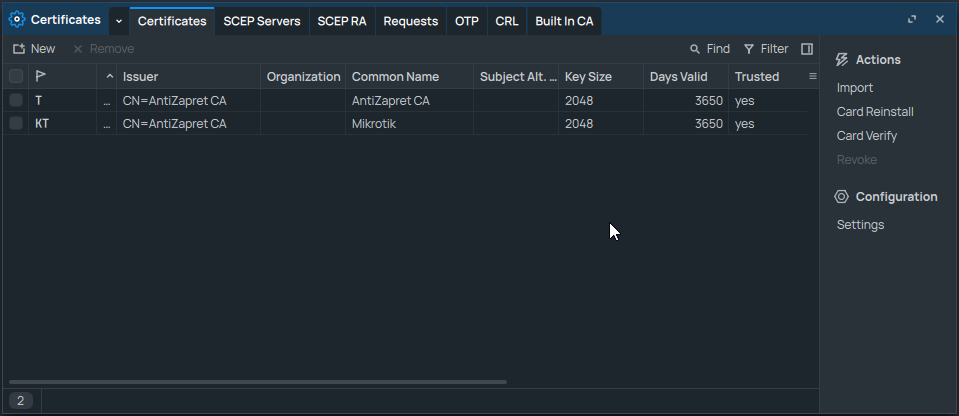
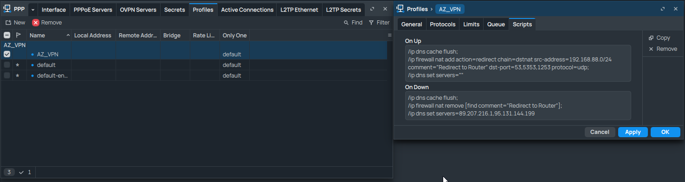
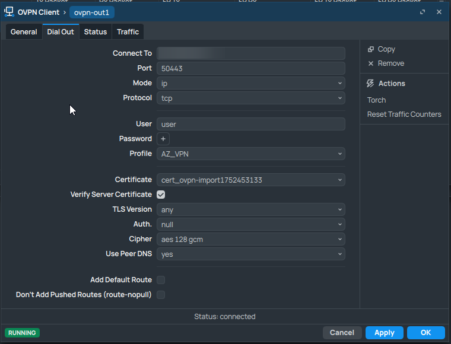
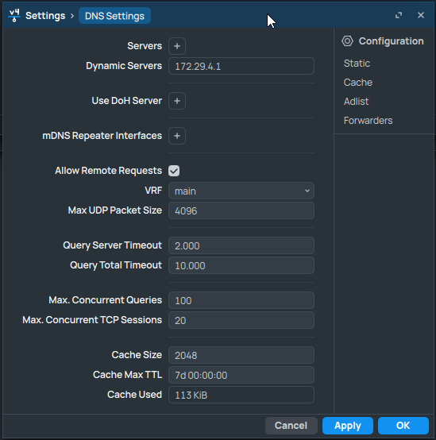
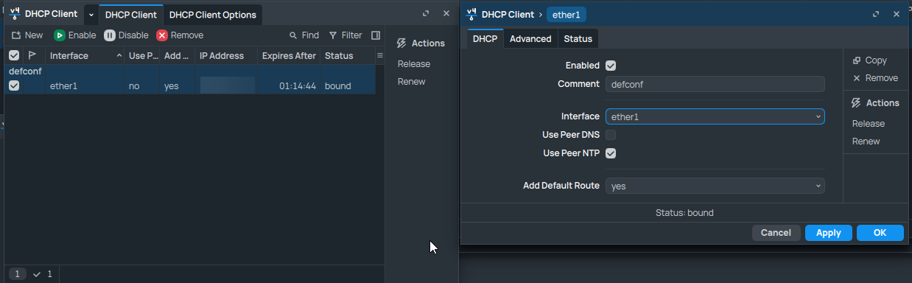

# 🚀 Настройка OpenVPN на MikroTik

> **Инструкция по подключению MikroTik к VPN-серверу через OpenVPN**  
> Все шаги сопровождаются пояснениями и иллюстрациями.

---

## � Оглавление
- [Что понадобится](#�📦-что-понадобится)
- [1️⃣ Подготовка сертификатов](#1️⃣-подготовка-сертификатов)
- [2️⃣ Настройка PPP-профиля](#2️⃣-настройка-ppp-профиля)
- [3️⃣ Настройка OpenVPN-клиента](#3️⃣-настройка-openvpn-клиента)
- [4️⃣ Настройка DNS](#4️⃣-настройка-dns)
- [5️⃣ Настройка DHCP-клиента](#5️⃣-настройка-dhcp-клиента)
- [6️⃣ Проверка подключения](#6️⃣-проверка-подключения)
- [💡 Полезные советы](#💡-полезные-советы)

## 📦 Что понадобится

- **Роутер MikroTik** с RouterOS (6+)
- **Доступ** к интерфейсу MikroTik (WinBox, WebFig или терминал)
- **Данные для VPN**: адрес сервера, порт, имя пользователя, пароль, сертификаты
- **Базовые знания** MikroTik (но всё объяснено максимально просто)

---

## 1️⃣ Подготовка сертификатов

Перед подключением к VPN-серверу необходимо импортировать сертификаты, которые обеспечивают защищённое соединение. Сертификаты обычно предоставляются в виде отдельных файлов или содержатся внутри `.ovpn`-конфига.

### Вариант 1. Извлечение сертификатов из `.ovpn`

1. Откройте файл `.ovpn` в текстовом редакторе. В самом низу файла найдите блоки:
    - `<ca></ca>` — корневой сертификат центра сертификации (CA)
    - `<cert></cert>` — ваш клиентский сертификат
    - `<key></key>` — приватный ключ клиента
2. Скопируйте содержимое каждого блока в отдельные файлы:
    - `<ca></ca>` → `ca.crt`
    - `<cert></cert>` → `client.crt`
    - `<key></key>` → `client.key`
3. Загрузите файлы на MikroTik:
    - **WinBox**:  
      Откройте вкладку **Files**, нажмите **Upload** и выберите ваши файлы.
4. Импортируйте сертификаты:
    - **WinBox**:  
      Перейдите в **System → Certificates**, нажмите **Import** и выберите каждый файл по очереди.
    - **Терминал**:
      ```
      /certificate import file-name=ca.crt
      /certificate import file-name=client.crt
      /certificate import file-name=client.key
      ```
    После импорта убедитесь, что сертификаты появились в списке и статус **trusted** — yes.

### Вариант 2. Импортировать весь `.ovpn`

1. Загрузите `.ovpn`-файл:
    - **WinBox**:  
      Откройте **Files**, нажмите **Upload** и выберите файл.
2. Импортируйте:
    - **WinBox**:  
      Перейдите в **PPP**, нажмите **Import .ovpn** и выберите файл.
    После этого сертификаты и настройки автоматически появятся в системе.

> **Проверьте сертификаты**  
> Перейдите в **System → Certificates** и убедитесь, что в колонке `trusted` стоит **yes** — это значит, что сертификаты приняты системой и готовы к использованию.

---

**💡 Пример: Загрузка сертификатов в Files**


*Files → Upload и System → Certificates → Import*

---

## 2️⃣ Настройка PPP-профиля

PPP-профиль определяет, как будет работать VPN-соединение: какие параметры безопасности, скрипты и маршруты будут применяться.

1. Создайте профиль, например, `VPN_PROFILE`:
    - **WinBox**:  
      Перейдите в **PPP → Profiles**, нажмите **Add (+)**, задайте имя профиля, остальные параметры можно оставить по умолчанию или настроить по необходимости.
    - **Терминал**:
      ```bash
      /ppp profile add name=VPN_PROFILE use-ipv6=yes use-mpls=default use-compression=default use-encryption=default only-one=default change-tcp-mss=default use-upnp=default
      ```
2. Добавьте скрипты для DNS и NAT:
    - **WinBox**:  
      Откройте созданный профиль, перейдите во вкладки **On Up** и **On Down**. Вставьте скрипты:
      ```
      on-up
      /ip dns cache flush;
      /ip firewall nat add action=redirect chain=dstnat src-address=*ВАША_ЛОКАЛЬНАЯ_СЕТЬ*/24 comment="Redirect to Router" dst-port=53,5353,1253 protocol=udp;
      /ip dns set servers=""
      on-down
      /ip dns cache flush;
      /ip firewall nat remove [find comment="Redirect to Router"];
      /ip dns set servers=*DNS_ПРОВАЙДЕРА*
      ```
      - **on-up** — выполняется при подключении VPN. Очищает кэш DNS, перенаправляет DNS-запросы на роутер, сбрасывает DNS-серверы.
      - **on-down** — выполняется при отключении VPN. Очищает кэш DNS, удаляет правило NAT, возвращает DNS-серверы провайдера.
    - **Терминал**:
      ```bash
      /ppp profile set VPN_PROFILE on-up="/ip dns cache flush;\n/ip firewall nat add action=redirect chain=dstnat src-address='*ВАША_ЛОКАЛЬНАЯ_СЕТЬ*'/24 comment=\"Redirect to Router\" dst-port=53,5353,1253 protocol=udp;\n/ip dns set servers=\"\""
      /ppp profile set VPN_PROFILE on-down="/ip dns cache flush;\n/ip firewall nat remove [find comment=\"Redirect to Router\"];\n/ip dns set servers='*DNS_ПРОВАЙДЕРА*'"
      ```

> **Как узнать параметры:**
> - *ВАША_ЛОКАЛЬНАЯ_СЕТЬ* — это адрес вашей локальной сети, например, 192.168.88.0.  
>   - **Консоль:** `/ip address print` — ищите строку с вашим локальным интерфейсом.
>   - **WinBox:** IP → Addresses → поле "Address" для нужного интерфейса.
> - *DNS_ПРОВАЙДЕРА* — DNS-серверы, которые выдает ваш провайдер.  
>   - **Консоль:** `/ip dhcp-client print detail` — ищите строку "dns-server".
>   - **WinBox:** IP → DHCP Client → выберите активный клиент → поле "DNS".

> **Описание:**
> - `on-up`: очищает кэш DNS, добавляет правило NAT для перенаправления DNS-запросов, сбрасывает DNS-серверы.
> - `on-down`: очищает кэш DNS, удаляет правило NAT, возвращает DNS-серверы провайдера.

---

**💡 Пример: PPP Profiles и On Up/On Down**


*PPP → Profiles → Add и вкладки On Up/On Down*

---

## 3️⃣ Настройка OpenVPN-клиента

OpenVPN-клиент — это интерфейс, через который роутер будет подключаться к VPN-серверу.

- **WinBox**:  
  Перейдите в **Interfaces → OVPN Client → Add (+)**. Заполните поля:
  - **Connect To** — адрес VPN-сервера (например, vpn.example.com)
  - **Port** — порт подключения 
  - **Mode** — ip
  - **Protocol** — tcp (или udp, если поддерживается)
  - **User** — имя пользователя для VPN
  - **Password** — пароль для VPN
  - **Profile** — ранее созданный профиль (например, VPN_PROFILE)
  - **Certificate** — имя импортированного сертификата
  - **Verify Server Certificate** — Включить
  - **TLS Version** — any 
  - **Auth** — null 
  - **Cipher** — aes128-gcm 
  - **Use Peer DNS** — yes 
  - **Add Default Route** — no 
  - **Route No Pull** — no 

- **Терминал**:
  ```bash
  /interface ovpn-client add name=ovpn-out1 connect-to=VPN_SERVER_ADDRESS port=VPN_PORT mode=ip protocol=tcp user=VPN_USER password="VPN_PASSWORD" profile=VPN_PROFILE certificate=VPN_CERTIFICATE verify-server-certificate=yes tls-version=any auth=null cipher=aes128-gcm use-peer-dns=yes add-default-route=no route-nopull=no
  ```

> **Пояснения параметров:**  
> - *VPN_SERVER_ADDRESS* — адрес VPN-сервера  
> - *VPN_PORT* — порт  
> - *VPN_USER* — имя пользователя  
> - *VPN_PASSWORD* — пароль  
> - *VPN_CERTIFICATE* — имя сертификата

---

**💡 Пример: OVPN Client Add**


*Interfaces → OVPN Client → Add*

---


## 🔥 Добавление правила маскарадинга для VPN

> Чтобы устройства вашей локальной сети могли выходить в интернет через VPN, необходимо добавить правило маскарадинга для интерфейса **ovpn-out1**.

### 🖥️ WinBox
1. Откройте **IP → Firewall → NAT**.
2. Нажмите **Add (+)**.
3. Заполните поля:
   - **Chain**: `srcnat`
   - **Action**: `masquerade`
   - **Out. Interface**: `ovpn-out1`
4. Добавьте комментарий: `Masquerade VPN` (по желанию).

### 💻 Терминал
Выполните команду:
```bash
/ip firewall nat add chain=srcnat action=masquerade out-interface=ovpn-out1 comment="Masquerade VPN"
```

**Зачем это нужно?**

> - Это правило подменяет исходящий IP-адрес устройств вашей сети на адрес роутера, чтобы трафик корректно проходил через VPN.
> - Без маскарадинга интернет через VPN работать не будет!

---

**💡 Пример: Маскарадинг для VPN**


*IP → Firewall → NAT → Add: Chain=srcnat, Action=masquerade, Out. Interface=ovpn-out1*
## 4️⃣ Настройка DNS

Для корректной работы устройств в вашей сети необходимо разрешить роутеру обрабатывать DNS-запросы.

- **WinBox**:  
  Перейдите в **IP → DNS** и поставьте галочку "Allow Remote Requests".
- **Терминал**:
  ```bash
  /ip dns set allow-remote-requests=yes
  ```

> **Это позволит роутеру отвечать на DNS-запросы от устройств в вашей сети и перенаправлять их через VPN.**

---

**💡 Пример: DNS Allow Remote Requests**


*IP → DNS*

---

## 5️⃣ Настройка DHCP-клиента

DHCP-клиент на основном интерфейсе (например, ether1) позволяет роутеру получать IP-адрес и другие параметры от провайдера.

- **WinBox**:  
  Перейдите в **IP → DHCP Client → Add (+)**.  
  Выберите интерфейс (например, ether1), уберите галочку "Use Peer DNS", поставьте галочку "Add Default Route".
- **Терминал**:
  ```bash
  /ip dhcp-client add interface=ether1 use-peer-dns=no add-default-route=yes
  ```

> - `use-peer-dns=no` — отключает получение DNS от провайдера, чтобы использовать свои настройки
> - `add-default-route=yes` — добавляет маршрут по умолчанию для выхода в интернет

> **Проверьте, что интерфейс ether1 подключён к интернету и получает IP-адрес.**

---

**💡 Пример: DHCP Client Add**


*IP → DHCP Client → Add*

---

## 6️⃣ Проверка подключения

После настройки всех параметров проверьте, что VPN работает корректно.

1. **Статус OpenVPN:**
    - **WinBox**:  
      Перейдите в **Interfaces → OVPN Client** и убедитесь, что статус интерфейса — "R" (running).
    - **Терминал**:
      ```bash
      /interface ovpn-client print
      ```
    Если статус "R", значит VPN подключён.
2. **Проверка интернета через VPN:**  
   Откройте сайт проверки IP (например, 2ip.ru или whatismyipaddress.com) с любого устройства в вашей локальной сети.  
   Если IP-адрес изменился на адрес VPN — всё работает!
3. **Проверка логов:**
    ```bash
    /log print
    ```
    В логах можно увидеть ошибки подключения, проблемы с сертификатами и другие детали.

## 💡 Полезные советы

- Если VPN не подключается:
  - Проверьте, что сертификаты импортированы и trusted = yes
  - Проверьте адрес и порт сервера
  - Проверьте правильность профиля и сертификата в настройках OVPN Client
- Если интернет не работает через VPN:
  - Проверьте маршруты:
    ```bash
    /ip route print
    ```
  - Проверьте, что правило NAT для DNS добавлено и работает
  - Проверьте, что устройства получают IP из вашей локальной сети
  - Для диагностики используйте:
    ```bash
    /tool torch interface=ovpn-out1
    ```
- Для безопасности:
  - В профиле используйте `use-encryption=yes`
  - Не публикуйте свои сертификаты и ключи в открытом доступе

> **Если что-то не работает — внимательно проверьте все шаги.**

---


