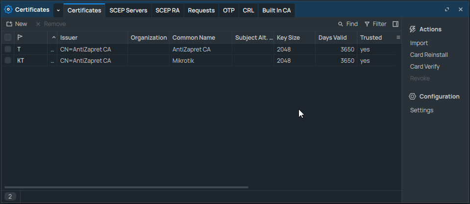
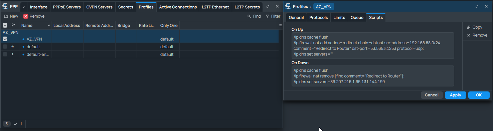
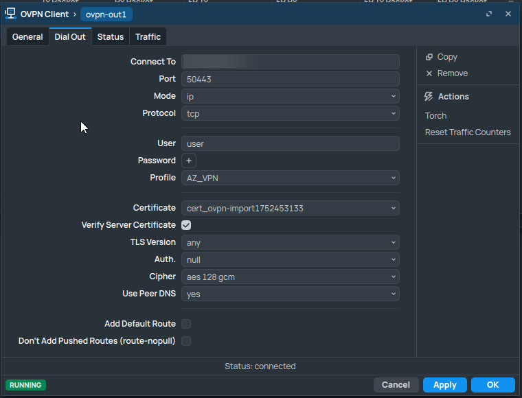
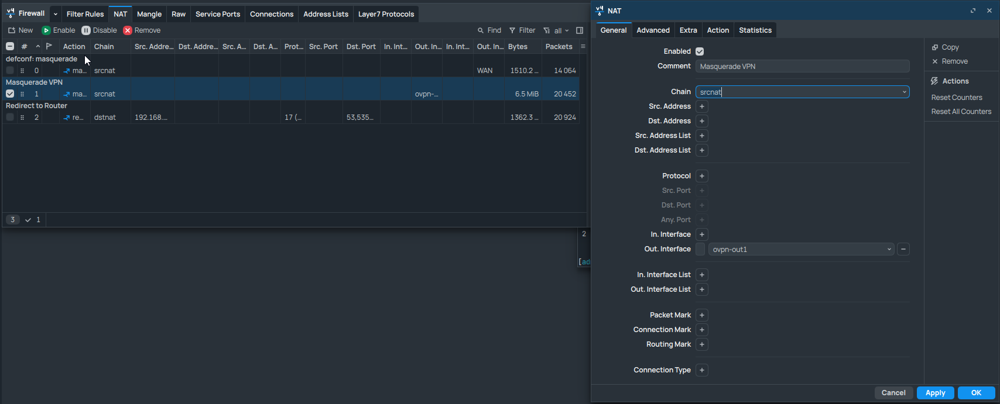
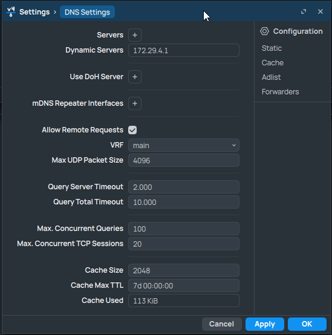
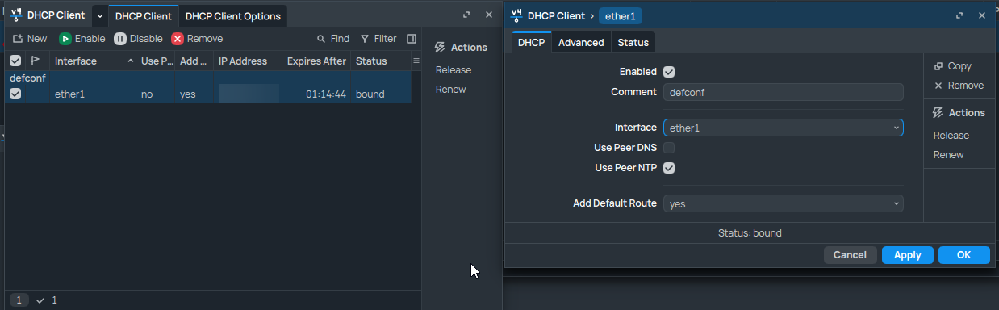

# 🚀 AntiZapret OpenVPN на MikroTik

> Инструкция по подключению MikroTik к **[AntiZapret-VPN](https://github.com/GubernievS/AntiZapret-VPN)** через OpenVPN.  
> Шаги с пояснениями и скриншотами WinBox + онлайн-генератор конфига.

Рекомендуется **RouterOS 7.x**. Для WireGuard смотрите [AntiZapret-WG-Mikrotik](https://github.com/Kirito0098/AntiZapret-WG-Mikrotik).

---

## Оглавление

- [Онлайн-генератор](#онлайн-генератор-github-pages)
- [Что понадобится](#-что-понадобится)
- [Схемы IP и порты](#-схемы-ip-и-порты)
- [1️⃣ Подготовка сертификатов](#1️⃣-подготовка-сертификатов)
- [2️⃣ PPP-профиль (On Up / On Down)](#2️⃣-ppp-профиль-on-up--on-down)
- [3️⃣ OpenVPN-клиент](#3️⃣-openvpn-клиент)
- [4️⃣ Masquerade](#4️⃣-masquerade)
- [5️⃣ DNS](#5️⃣-dns)
- [6️⃣ WAN: DHCP или PPPoE](#6️⃣-wan-dhcp-или-pppoe)
- [7️⃣ Проверка](#7️⃣-проверка)
- [Автоустановка fill/](#автоустановка-fill)
- [Полезные советы](#-полезные-советы)

---

### Онлайн-генератор (GitHub Pages)

Откройте **[генератор конфига](https://kirito0098.github.io/AntiZapret-OpenVPN-Mikrotik/)** → вставьте `*.ovpn` → скачайте `ca.crt` / `client.crt` / `client.key` и `az-ovpn-ready.rsc` → загрузите в Files → импортируйте сертификаты → `/import file-name=az-ovpn-ready.rsc`.

Ключи обрабатываются **только в браузере**.

---

## 📦 Что понадобится

- Роутер MikroTik с **RouterOS 7.x**
- WinBox / WebFig / Terminal
- Клиентский файл с сервера AntiZapret:  
  `/root/antizapret/client/` → лучше **`*-udp.ovpn`** (также есть `*-tcp.ovpn`)
- На сервере AntiZapret для MikroTik часто ставят патч OpenVPN **Error-free** (см. setup AntiZapret-VPN)

---

## 🔢 Схемы IP и порты

| | OpenVPN UDP | OpenVPN TCP |
|--|-------------|-------------|
| Клиент / DNS (схема `10…`) | `10.29.0.x` / `10.29.0.1` | `10.29.4.x` / `10.29.4.1` |
| Клиент / DNS (схема `172…`) | `172.29.0.x` / `172.29.0.1` | `172.29.4.x` / `172.29.4.1` |

**Порты:** основные **50080** и **50443**; резерв **80**, **443**, **504**, **508**.

**Маршруты:** сервер пушит их через OpenVPN CCD (`route-nopull=no` на клиенте).  
Отдельного `mikrotik-openvpn-routes.txt` нет (в отличие от WireGuard).  
После обновления списков AntiZapret на сервере — **переподключите** OVPN-клиент на MikroTik.

**Шифрование:** по умолчанию AES-128-GCM → на MikroTik `cipher=aes128-gcm`. Без AES-NI попробуйте `chacha20-poly1305`.

---

## 1️⃣ Подготовка сертификатов

### Вариант A — генератор / извлечение из `.ovpn`

1. В [генераторе](https://kirito0098.github.io/AntiZapret-OpenVPN-Mikrotik/) вставьте `.ovpn` и скачайте `ca.crt`, `client.crt`, `client.key`  
   **или** вырежьте блоки `<ca>`, `<cert>`, `<key>` вручную.
2. **Files → Upload** на MikroTik.
3. **System → Certificates → Import** (по очереди: CA, cert, key):

```mikrotik
/certificate import file-name=ca.crt
/certificate import file-name=client.crt
/certificate import file-name=client.key
```

Проверьте, что у CA **trusted = yes**. Имя клиентского сертификата часто `client.crt_0` — его укажите в OVPN Client / генераторе.

### Вариант B — PPP → Import .ovpn

Загрузите весь `.ovpn` в Files → **PPP → Import .ovpn**. Сертификаты и часть настроек появятся сами; профиль и NAT всё равно проверьте по инструкции ниже.


*Files → Upload и System → Certificates → Import*

---

## 2️⃣ PPP-профиль (On Up / On Down)

Создайте профиль, например `VPN_PROFILE`.

### Один VPN (только AntiZapret) — рекомендуется

- **On Up:**
  ```
  /ip dns cache flush;
  ```
- **On Down:**
  ```
  /ip dns cache flush;
  /ip dns set servers=8.8.8.8
  ```

Готовые тексты: [`scripts/ovpn-monitor-up.rsc`](scripts/ovpn-monitor-up.rsc), [`scripts/ovpn-monitor-down.rsc`](scripts/ovpn-monitor-down.rsc).

DNS AntiZapret приходит с OVPN (`use-peer-dns=yes` на клиенте) — не дублируйте жёсткий DNS в On Up.

### Несколько VPN

Нужны Redirect DNS + mangle. Скрипты: [`scripts/ovpn-monitor-up-multi.rsc`](scripts/ovpn-monitor-up-multi.rsc), [`scripts/ovpn-monitor-down-multi.rsc`](scripts/ovpn-monitor-down-multi.rsc).

```mikrotik
/ip firewall mangle add chain=postrouting src-address=192.168.88.0/24 \
    action=add-src-to-address-list address-list=RedirectDNS address-list-timeout=1m \
    out-interface=ovpn-out1
```


*PPP → Profiles → Add и вкладки On Up/On Down*

---

## 3️⃣ OpenVPN-клиент

**Interfaces → OVPN Client → Add:**

| Поле | Значение |
|------|----------|
| Connect To | хост из `remote` |
| Port | из `.ovpn` (часто 50080) |
| Mode | ip |
| Protocol | **udp** (предпочтительно) или tcp |
| User / Password | из `.ovpn` |
| Profile | `VPN_PROFILE` |
| Certificate | имя после Import |
| Verify Server Certificate | yes |
| TLS Version | any |
| Auth | часто `null` при GCM |
| Cipher | `aes128-gcm` |
| Use Peer DNS | **yes** |
| Add Default Route | **no** |
| Route No Pull | **no** (тянуть маршруты AntiZapret) |

```mikrotik
/interface ovpn-client add name=ovpn-out1 connect-to=vpn.example.com port=50080 mode=ip \
    protocol=udp user=antizapret-client profile=VPN_PROFILE certificate=client.crt_0 \
    verify-server-certificate=yes tls-version=any auth=null cipher=aes128-gcm \
    use-peer-dns=yes add-default-route=no route-nopull=no
```


*Interfaces → OVPN Client → Add*

---

## 4️⃣ Masquerade

Чтобы LAN ходила в интернет через VPN:

```mikrotik
/ip firewall nat add chain=srcnat action=masquerade out-interface=ovpn-out1 comment="Masquerade VPN"
```


*IP → Firewall → NAT*

---

## 5️⃣ DNS

Разрешите роутеру отвечать клиентам LAN:

```mikrotik
/ip dns set allow-remote-requests=yes
```


*IP → DNS*

---

## 6️⃣ WAN: DHCP или PPPoE

Отключите DNS провайдера, иначе он перебьёт AntiZapret.

### DHCP / кабель (часто `ether1`)

```mikrotik
/ip dhcp-client set [find interface=ether1] use-peer-dns=no
```

### PPPoE

Укажите **имя PPPoE-клиента** (`pppoe-out1`), не физический `ether1`:

```mikrotik
/interface pppoe-client set [find name=pppoe-out1] use-peer-dns=no
/interface list member add list=WAN interface=pppoe-out1
```

(Автоустановщик / генератор добавят член WAN, если его ещё нет.)


*IP → DHCP Client (вариант DHCP)*

---

## 7️⃣ Проверка

```mikrotik
/interface ovpn-client print
```

Статус **R** (running) — туннель поднят. Проверьте IP на 2ip.ru с устройства в LAN.

```mikrotik
/ip route print
/log print
```

После обновления списков на сервере AntiZapret: отключите/включите OVPN-клиент (reconnect), чтобы подтянуть новые маршруты.

---

## Автоустановка (`fill/`)

1. Импортируйте сертификаты (см. §1).
2. Скопируйте [`fill/az-ovpn-vars.rsc.example`](fill/az-ovpn-vars.rsc.example) → `az-ovpn-vars.rsc`, заполните.
3. Загрузите вместе с [`fill/az-ovpn-install.rsc`](fill/az-ovpn-install.rsc).
4. Терминал:

```mikrotik
/import file-name=az-ovpn-vars.rsc
/import file-name=az-ovpn-install.rsc
```

Пример команд: [`example-ovpn.rsc`](example-ovpn.rsc).

---

## 💡 Полезные советы

- Не подключается: сертификаты trusted? порт/proto? имя `certificate` совпадает с Certificates?
- Нет интернета через VPN: есть ли Masquerade на `ovpn-out1`? `route-nopull=no`?
- DNS «ломается»: на WAN `use-peer-dns=no`; на OVPN `use-peer-dns=yes`
- MTU / FastTrack: при обрывах попробуйте clamp MSS в профиле (`change-tcp-mss=yes`) или временно отключить FastTrack
- Не публикуйте `.ovpn`, `.crt`, `.key` в git (см. `.gitignore`)

> Сервер и клиенты: [GubernievS/AntiZapret-VPN](https://github.com/GubernievS/AntiZapret-VPN)  
> WireGuard на MikroTik: [AntiZapret-WG-Mikrotik](https://github.com/Kirito0098/AntiZapret-WG-Mikrotik)
